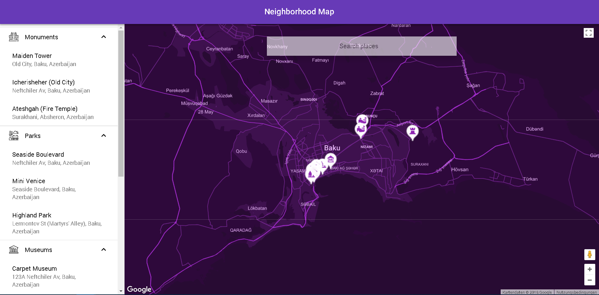
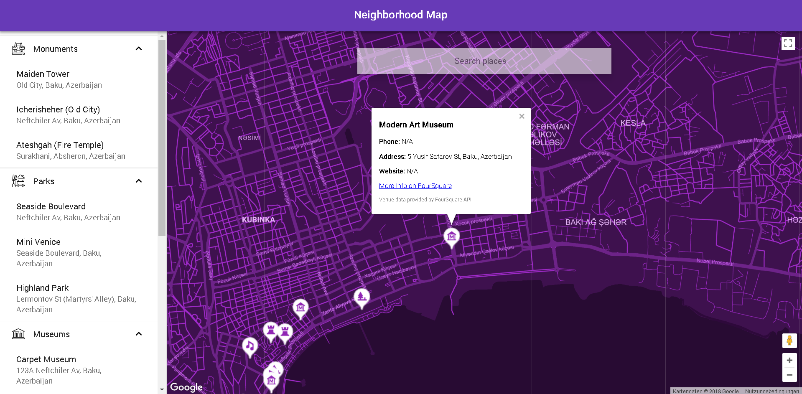
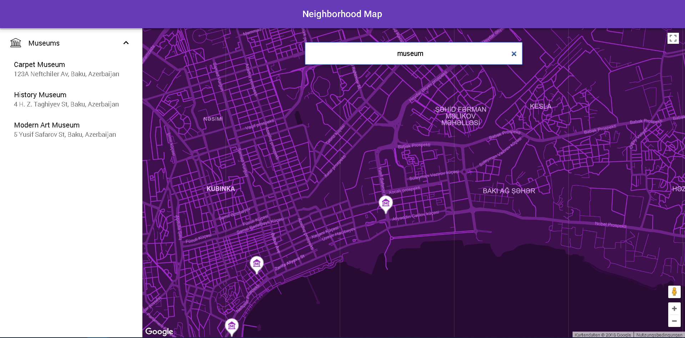
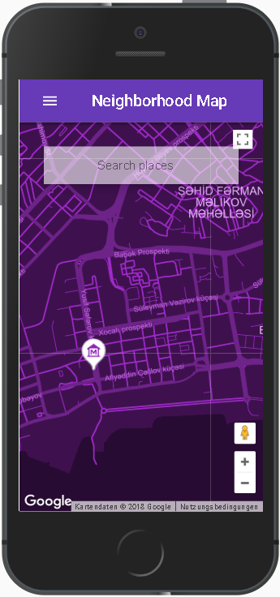

# Neighborhood Maps Project

## Project Overview

The goal of this project is to create a single-page application using React featuring a map of the neighborhood. The application uses the Google Maps API to display points of interest ("POI") in my vicinity, and pulls detailled information from FourSquare's Venues API. Additionally, presents a filterable list of location names, and updates the markers according to the search query.

## App Functionality

In this application, the main page displays a list of POIs and the map containing the markers of the POIs.

There is also map containing all the marker and additional information provided by 3rd party API provider displayed via the InfoWindow.

User may filter places list using the search input located over the map.

The app is very responsive and provides outstanding design for mobile users.

## Installation and Running

To configure and run this app you will have to have [**Node.js**](https://nodejs.org/en/) and [**npm**](https://www.npmjs.com/get-npm) installed in your machine.

Please follow below instructions to setup and run the project in your machine:

### Project Setup

1. Clone repository to your local disk
2. Open terminal and navigate to the project folder
3. Run `npm install` command from terminal to install all npm dependencies

### Running Project

#### `npm start`

Runs the app in the development mode and opens [http://localhost:3000](http://localhost:3000) to view the app in the browser. The page will be automatically reloaded if you make any changes.

You will also see any lint errors in the console.

### `npm test`

Runs the test watcher in an interactive mode.

By default, runs tests related to files changed since the last commit.

[Read more about testing.](https://github.com/facebook/create-react-app/blob/master/packages/react-scripts/template/README.md#running-tests)

### `npm run build`

Builds the app for production to the `build` folder.

It correctly bundles React in production mode and optimizes the build for the best performance.

The build is minified and the filenames include the hashes.

By default, it also [includes a service worker](https://github.com/facebook/create-react-app/blob/master/packages/react-scripts/template/README.md#making-a-progressive-web-app) so that your app loads from local cache on future visits.

Your app is ready to be deployed.

## Data Attribution

Data for the InfoWindows connected to the map markers is provided by FourSquare's venue details API. Details on the API can be found [here](https://developer.foursquare.com/docs/api/venues/detail).

## License

    Copyright 2018 Orkhan Gasimli

    Licensed under the Apache License, Version 2.0 (the "License");
    you may not use this file except in compliance with the License.
    You may obtain a copy of the License at

        http://www.apache.org/licenses/LICENSE-2.0

    Unless required by applicable law or agreed to in writing, software
    distributed under the License is distributed on an "AS IS" BASIS,
    WITHOUT WARRANTIES OR CONDITIONS OF ANY KIND, either express or implied.
    See the License for the specific language governing permissions and
    limitations under the License.